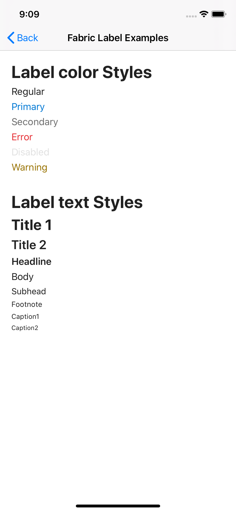

# Xamarin.Forms Office UI Fabric

C# wrapper for the Office UI Fabric libs for Android and iOS. All a Fabric visual implementation for easy use with the Xamarin.Forms.

## Milestones
- Add build instructions and CI setup
- Build and publish NuGet package to support Xamarin.Android and Xamarin.iOS from the CI.
- Add new project to expose the Fabric Visual and platform renderers to make it easy to use Fabric UI with the Xamarin.Forms apps (currently added in the Samples project).
- Publish Fabric Visual Nuget Package for the Xamarin.Forms.
- Test more controls and add to the Sample project.

## Working Control examples
**iOS**

